```{r setup, include=FALSE}
knitr::opts_chunk$set(echo = FALSE)

```

# Environment A

*Run 10000 episodes of Q-learning with* $\epsilon = 0.5$, $\beta = 0$, $\alpha = 0.1$ and $\gamma = 0.95$.

The picture below displays environment A. The agent starts in state (3,1).

```{r, image_container_2, echo=FALSE, out.width='80%', fig.align='center'}
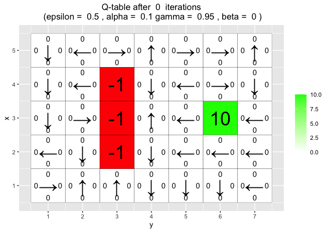
```

After 10 episodes the q-table have started to change.

*Q-table for environment A after 10 episodes*

```{r, image_container_3, echo=FALSE, out.width='80%', fig.align='center'}
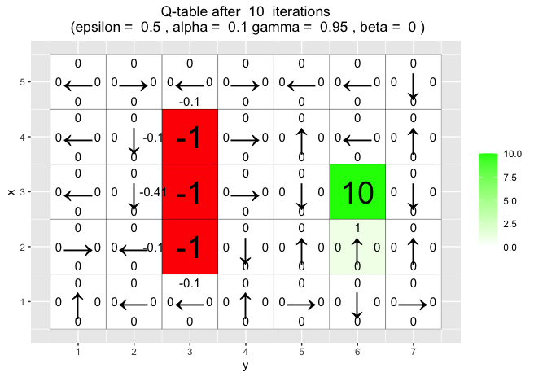
```

*What has the agent learned after the first 10 episodes ?*

The agent has begun to learn to avoid the negative rewards. However it is just on the same side as the starting state (3,1).

*Q-table for environment A after 10000 episodes*

```{r, image_container_4, echo=FALSE, out.width='80%', fig.align='center'}
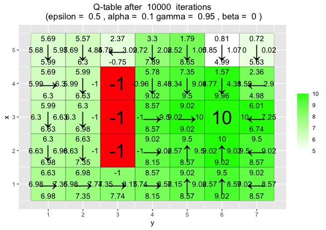
```

*Is the final greedy policy (after 10000 episodes) optimal? Why / Why not ?*

No the final greedy policy is not optimal. Since for example starting in state (5,3) would lead an agent using this policy on a longer route than needed.

*Does the agent learn that there are multiple paths to get to the positive reward ? If not, what could be done to make the agent learn this ?*

Yes, it does. If it had not, one can set epsilon to a value closer to 1 and thereby making the agent do more exploration.

# Environment B

The picture below displays environment B. The agent starts in state (4,1).

```{r, image_container_5, echo=FALSE, out.width='80%', fig.align='center'}
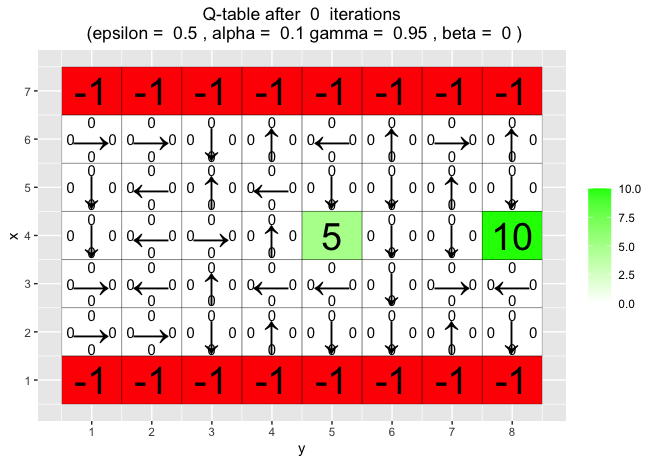
```

*Your task is to investigate how the* $\epsilon$ *and* $\gamma$ *parameters affect the learned policy by running 30000 episodes of Q-learning with* $\epsilon = 0.1, 0.5$ $\gamma = 0.5, 0.75, 0.95$ $\alpha = 0.1$ $\beta = 0$.

```{r, echo=FALSE, fig.show='hold', fig.align='center', out.width="49%"}
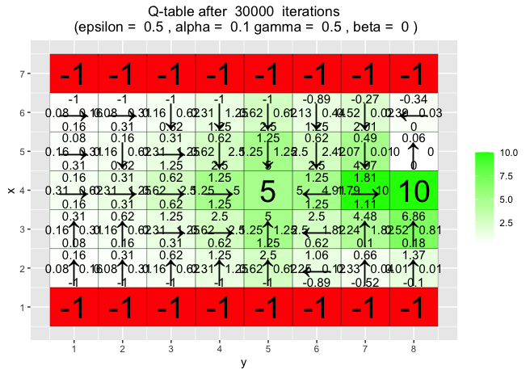
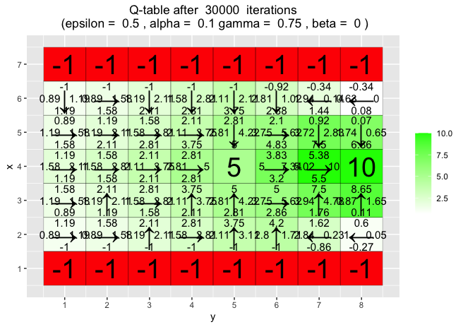
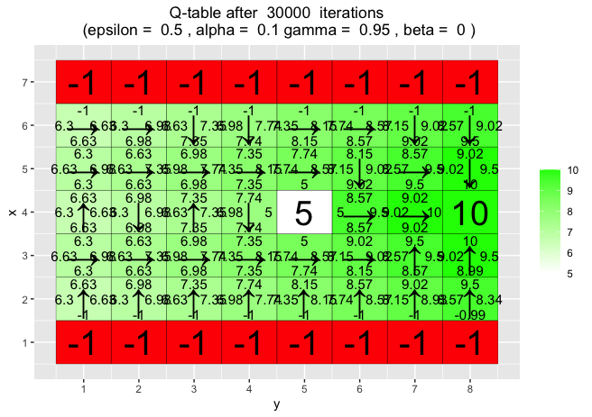
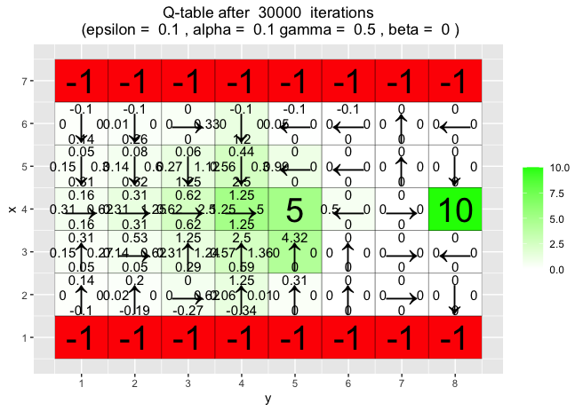
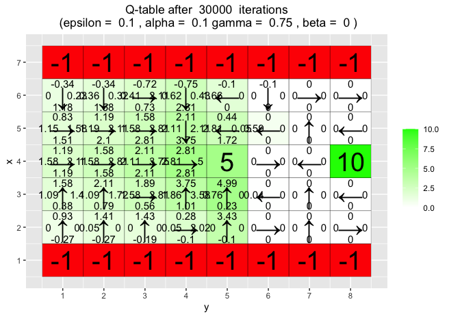
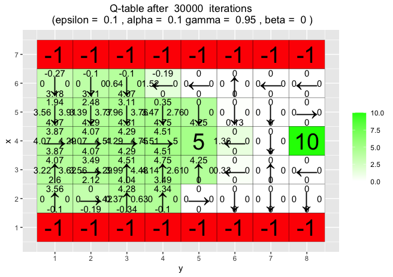
```

**Observations:**

+ With higher $\epsilon$ more states are visited. When setting a larger $\gamma$, meaning that the value of the new q-state is less discounted, the agent is able to find the larger reward since it values it more.
+ One can noticed that a low $\epsilon$ will inhibit the Agent from finding the larger reward even when $\gamma$ is close to 1.

# Environment C

The picture below displays environment C. The agent starts in state (1,1).

```{r, image_container_6, echo=FALSE, out.width='80%', fig.align='center'}
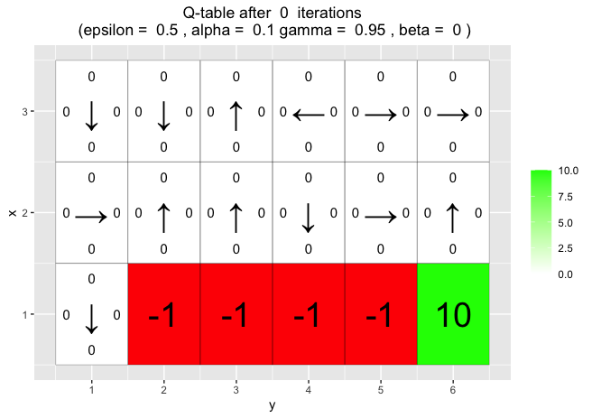
```

*Investigate how the* $\beta$ *parameter affects the learned policy by running 10000 episodes of Q-learning with* $\beta = 0, 0.2, 0.4, 0.66$, $\epsilon = 0.5$, $\gamma = 0.6$, *and* $\alpha = 0.1$.


In the pictures below the developed policy for each combination of parameters is presented.

```{r, echo=FALSE, fig.show='hold', fig.align='center', out.width="49%"}
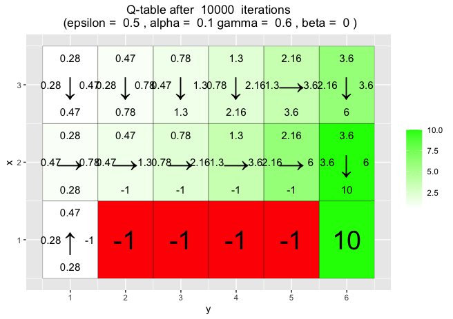
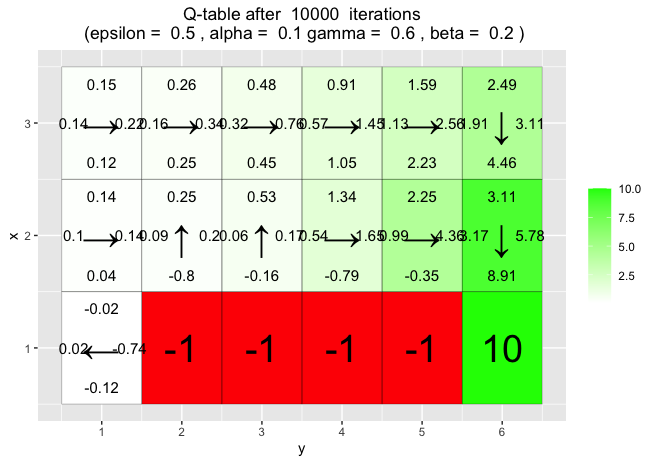
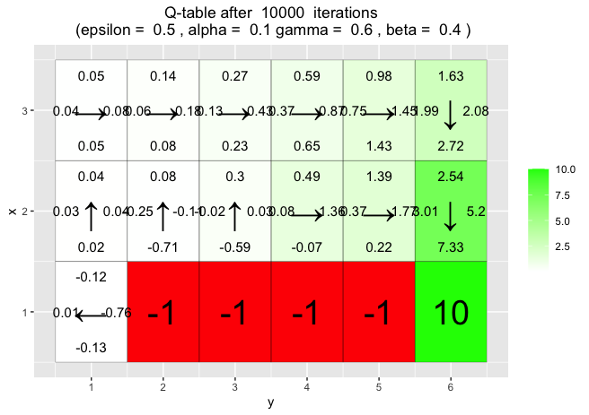
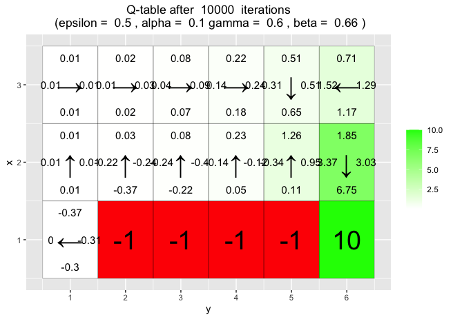
```

**Observations:**

+ $\beta$ is the "slipping factor" which can make the agent go into another direction than intended during the transition step.
+ When $\beta$ is large the identified path is not the optimal. The agent "avoids" using row 2 since it has slipped onto the negative rewards on row 1.


---

In the two environments below the REINFORCE algorithm was used to train the agent.

# Environment D

```{r}
train_goals <- list(c(4,1), c(4,3), c(3,1), c(3,4), c(2,1), c(2,2), c(1,2), c(1,3))
val_goals <- list(c(4,2), c(4,4), c(3,2), c(3,3), c(2,3), c(2,4), c(1,1), c(1,4))
```


The code is provided in the lab. It will run 5000 episodes of the REINFORCE algorithm using the values $\beta = 0$ and $\gamma = 0.95$. Each training episode uses a random position from `train_goals = ` `r train_goals`.

When training is completed, the code validates the policies created byt the neural network for the goal positions in `val_goals = ` `r val_goals`.

Below is the policies for each of the validation goals.

```{r, echo=FALSE, fig.show='hold', fig.align='center', out.width="49%"}
knitr::include_graphics("./pictures-2/9.png")
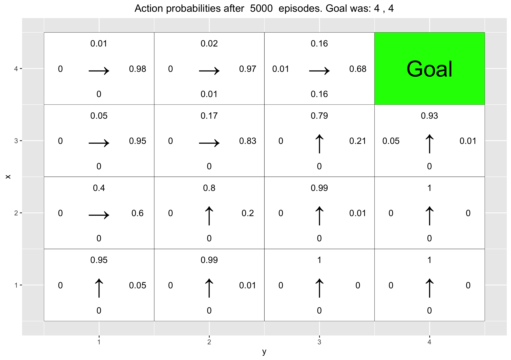
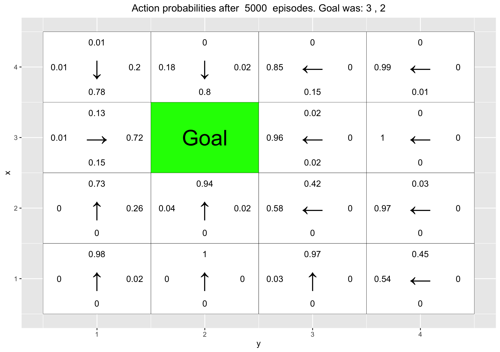
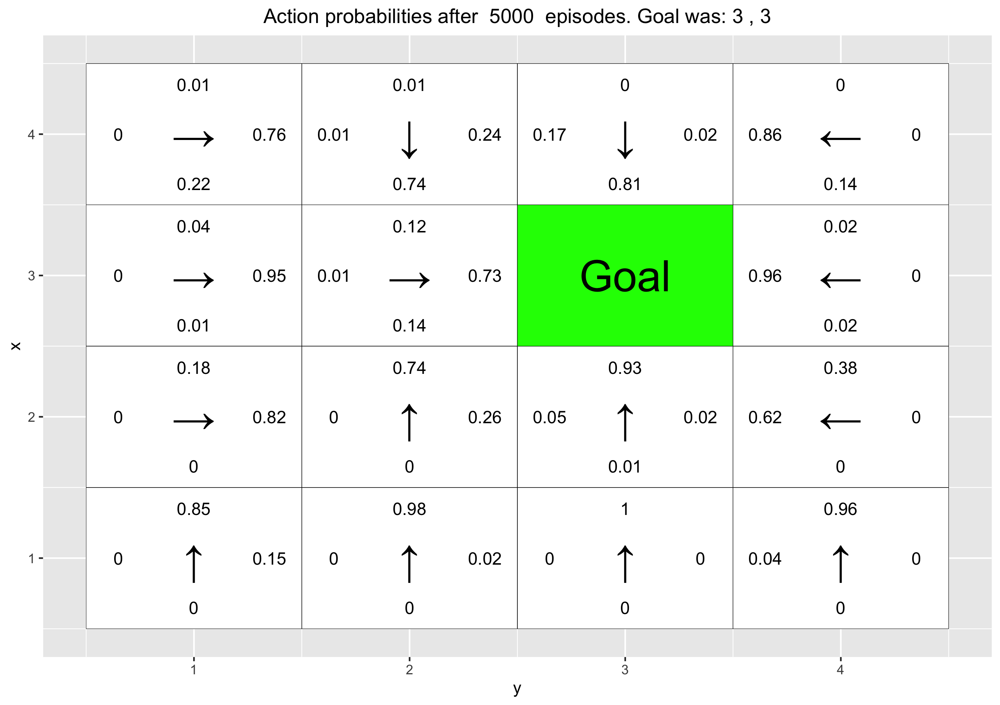
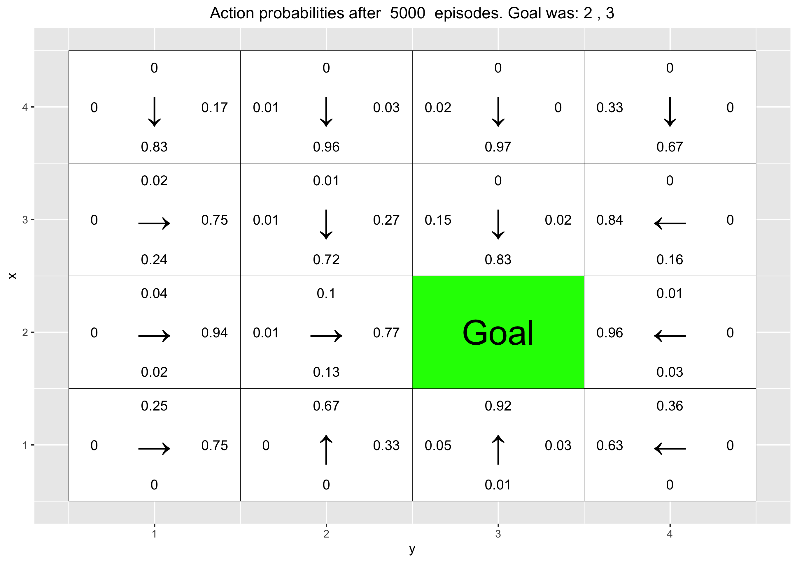
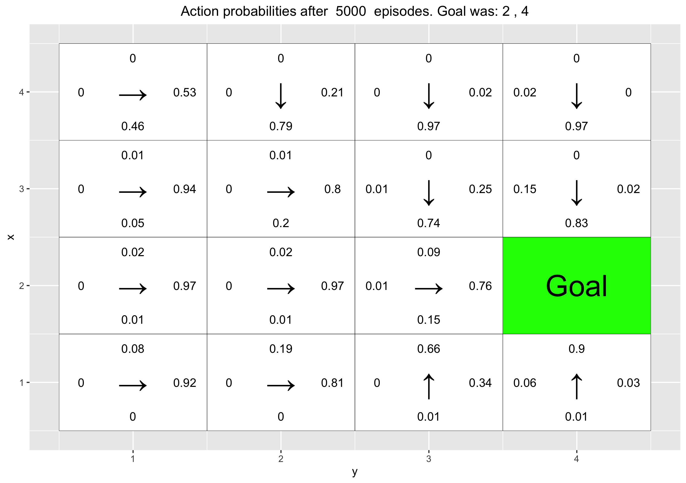
knitr::include_graphics("./pictures-2/15.png")
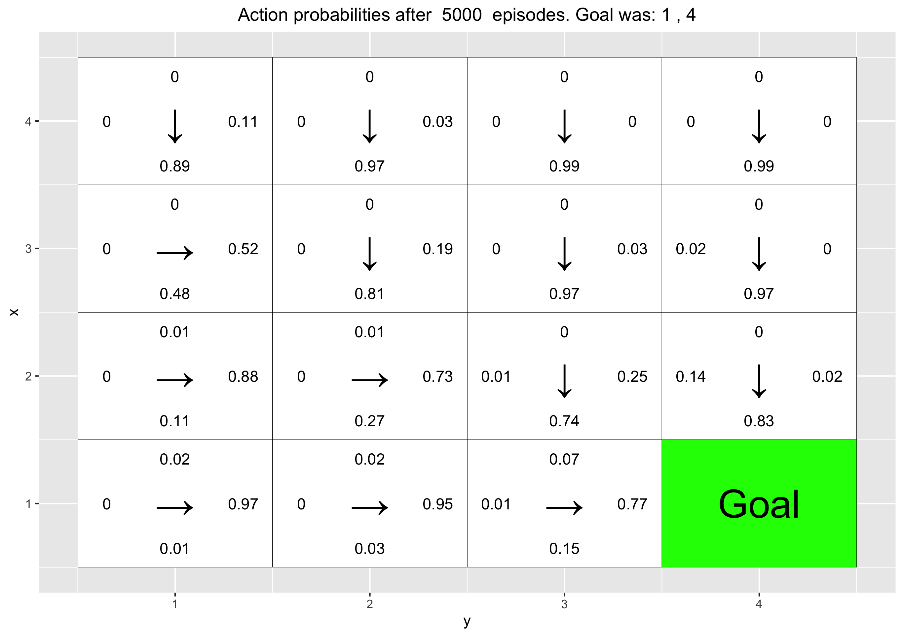
```

*Has the agent learned a good policy? Why / Why not?*

Yes the agent has learned a good policy because where ever you start you will reach the goal state. Further the training goal states are spread out in the environment and selected by random thereby making it possible for the agent to learn some degree of generalization and not become biased.

*Could you have used the Q-learning algorithm to solve this task?*

No, the Q-learning algorithm will not work since it can only develop policies for targets it has already seen. On the other hand the neural network can generalize and thereby develop a policy for previously "unseen" goals.


# Environment E


```{r}
train_goals <- list(c(4,1), c(4,2), c(4,3), c(4,4))
val_goals <- list(c(3,4), c(2,3), c(1,1))
```

Repeat the previous experiments but this time the goals for training are all from the top row of the grid. The validation goals are three positions from the rows below.

Training goals: `train_goals = ` `r train_goals`.

Validation goals: `val_goals = ` `r val_goals`.

Below is the policies for each of the validation goals.

```{r, echo=FALSE, fig.show='hold', fig.align='center', out.width="49%"}
knitr::include_graphics("./pictures-2/E-4.png")
knitr::include_graphics("./pictures-2/E-5.png")
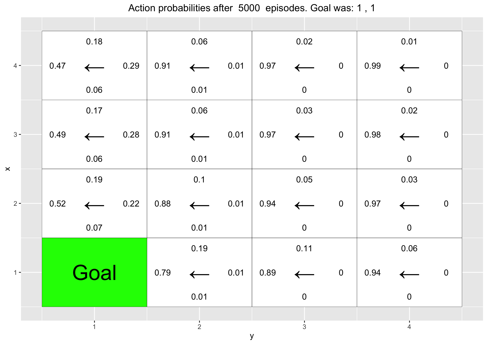

```

*Has the agent learned a good policy? Why / Why not ?*

No, the policy is bad since it will not always find the goal using it.

*If the results obtained for environments D and E differ, explain why.*

In the training data for environment E all of the goals are in the top row. This leads the network to "put extra weight" to this part of the environment. The network becomes biased towards this area. The model can be said to be overfitted towards rewards/ goals in the top row. The network will develop policies that do not find the goals as accurately or at all.

\newpage

## Appendix for code

### Part 1

```{r, code=readLines("RL_Lab1.R"), echo=TRUE, eval=FALSE}
```

\newpage

### Part 2

```{r, code=readLines("RL_Lab2.R"), echo=TRUE, eval=FALSE}
```