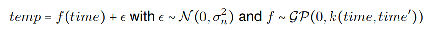
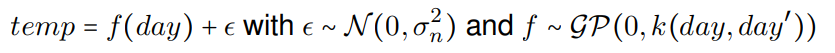
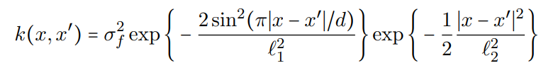

```{r Set up, include=FALSE}
knitr::opts_chunk$set(echo = FALSE)
```

## Task 1.1

```{r task_1_1, echo=FALSE, warning=FALSE}
sq_exp <- function(x, xStar, sigmaF, l) {
  n1 <- length(x)
  n2 <- length(xStar)
  k <- matrix(NA, n1, n2)
  for (i in 1:n2) {
    k[, i] <- sigmaF ^ 2 * exp(-0.5 * ((x - xStar[i]) / l) ^ 2)
  }
  return(k)
}

posterior_GP <- function(x, y, xStar, sigmaNoise, sigmaF, l) {
  n <- length(x)
  
  #Covariance matrices
  K_X_X <- sq_exp(
    x = x,
    xStar = x,
    sigmaF = sigmaF,
    l = l
  )
  K_X_XStar <- sq_exp(
    x = x,
    xStar = xStar,
    sigmaF = sigmaF,
    l = l
  )
  K_XStar_XStar <- sq_exp(
    x = xStar,
    xStar = xStar,
    sigmaF = sigmaF,
    l = l
  )
  
  
  L <- t(chol(K_X_X + sigmaNoise ^ 2 * diag(n)))
  
  
  alphaB <- solve(a = L,
                  b = y)
  alpha <- solve(a = t(L),
                 b = alphaB)
  
  # Compute posterior mean of f
  posterior_mean_f <- t(K_X_XStar) %*% alpha
  
  v <- solve(a = L,
             b = K_X_XStar)
  
  post_cov_matrix_f <- K_XStar_XStar - t(v) %*% v
  
  post_var_f <- diag(post_cov_matrix_f)
  
  return (data.frame(mean = posterior_mean_f, variance = post_var_f))
}

plot_GP <- function(mean, grid, var, obs) {
  
  confI <- data.frame(upper = mean + 1.96*sqrt(var), lower = mean - 1.96*sqrt(var))
  ylim <- c(min(confI$lower) - 1,
            max(confI$upper) + 1)
  
  plot(x=grid, y=mean, type="l",ylim=ylim, main="Observations with confidence interval", sub="Red=confidence interval, Green=observation, Black=mean")
  lines(x=grid, y=confI$upper, col="red")
  lines(x=grid, y=confI$lower, col="red")
  
  
  
  points(obs$x, obs$y, col="green")
  
  
}
```


See code.

## Task 1.2 

```{r task_1_2, echo=FALSE, warning=FALSE}
### TASK 2.1.2 ###

sigmaF <- 1
sigmaNoise <- 0.1

l <- 0.3

obs <- data.frame(x=c(0.4), y=c(0.719))

xGrid <- seq(-1, 1, 0.01)

postF <-
  posterior_GP(
    x = obs$x,
    y = obs$y,
    xStar = xGrid,
    sigmaF = sigmaF,
    sigmaNoise = sigmaNoise,
    l = l
  )

plot_GP(postF$mean, xGrid,postF$variance,obs)


```

See graph above for graph with obs in $(0.4,0.0719)$.

## Task 1.3

```{r task_1_3, echo=FALSE, warning=FALSE}

### TASK 2.1.3 ###


obs <- data.frame(x=c(0.4,-0.6), y=c(0.719,-0.044))


postF <-
  posterior_GP(
    x = obs$x,
    y = obs$y,
    xStar = xGrid,
    sigmaF = sigmaF,
    sigmaNoise = sigmaNoise,
    l = l
  )

plot_GP(postF$mean, xGrid,postF$variance,obs)
```


## Task 1.4

```{r task_1_4, echo=FALSE, warning=FALSE}

### TASK 2.1.4 ###


obs <- data.frame(x=c(-1,-0.6,-0.2,0.4,0.8), y=c(0.768,-0.044, -0.940,0.719,-0.664))

postF <-
  posterior_GP(
    x = obs$x,
    y = obs$y,
    xStar = xGrid,
    sigmaF = sigmaF,
    sigmaNoise = sigmaNoise,
    l = l
  )

plot_GP(postF$mean, xGrid,postF$variance,obs)


```

See graph above.

## Task 1.5

```{r task_1_5, echo=FALSE, warning=FALSE}
### TASK 2.1.5 ###

sigmaF <- 1
l <- 1

postF <-
  posterior_GP(
    x = obs$x,
    y = obs$y,
    xStar = xGrid,
    sigmaF = sigmaF,
    sigmaNoise = sigmaNoise,
    l = l
  )

plot_GP(postF$mean, xGrid,postF$variance,obs)


# The result of changing l and sigma f is that it becomes a lot smoother. The accuracy is a lot worse though as all the observations are outside of the confidence intervals.


```

*Compare the results.*

The result of changing $\ell$ and $\sigma_f$ is that it becomes a lot smoother. The accuracy is a lot worse though as all the observations are outside of the confidence intervals.

# TASK 2.1 
*Create the variable time which records the day number since the start of the dataset (i.e.,
time= 1, 2, . . ., 365 × 6 = 2190). Also, create the variable day that records the day number
since the start of each year (i.e., day= 1, 2, . . ., 365, 1, 2, . . ., 365). Estimating a GP on 2190
observations can take some time on slower computers, so let us subsample the data and use
only every fifth observation. This means that your time and day variables are now time= 1, 6,
11, . . ., 2186 and day= 1, 6, 11, . . ., 361, 1, 6, 11, . . ., 361.*
<br /> <br />

*Define your own square exponential kernel function (with parameters ell and sigmaf
(sigmaf)), evaluate it in the point x = 1, x' = 2, and use the kernelMatrix function
to compute the covariance matrix K(X, Xstar) for the input vectors X = T(1, 3, 4) and
Xstar = T(2, 3, 4).
*

```{r echo=TRUE, eval=TRUE}
data = read.csv("https://github.com/STIMALiU/AdvMLCourse/raw/master/GaussianProcess/Code/TempTullinge.csv", header=TRUE, sep=";")

# Creating variables with index for every fifth reading
tempTime = 1:2190
time = tempTime[seq(1,2190,5)]
dayNr = 1:365
tempDay = c()
for(i in 1:6){
  tempDay = c(tempDay, dayNr)
}
day = tempDay[seq(1,2190,5)]
temperature = unlist(data['temp'])
tempSubset = temperature[time]

# Returns a square exponential kernel function
# INPUTS:
#   sigmaf: standard deviation for f
#   ell: Smoothing factor
squareExpKernel <- function(sigmaf = 1, ell = 1) 
{
  rval <- function(x, y = NULL) {
    r = crossprod(x-y);
    #return((sigmaf**2)*exp(-r/2*(ell**2)))
    return(sigmaf^2 * exp(-0.5 * r / ell^2))
  }
  class(rval) <- "kernel"
  return(rval)
  
}
```

```{r echo=FALSE, eval=TRUE}
library(kernlab)

# Code from earlier part of lab
library("mvtnorm")

# Covariance function
SquaredExpKernel <- function(x1,x2,sigmaF=1,l=3){
  n1 <- length(x1)
  n2 <- length(x2)
  K <- matrix(NA,n1,n2)
  for (i in 1:n2){
    K[,i] <- sigmaF^2*exp(-0.5*( (x1-x2[i])/l)^2 )
  }
  return(K)
}

# Gaussian Regression Model
# INPUTS:
#   X: Vector of training inputs.
#   y: Vector of training targets/outputs.
#   XStar: Vector of inputs where the posterior distribution is evaluated.
#   sigmaNoise: Noise standard deviation.
#   k: Covariance function or kernel. That is, the kernel should be a separate function
posteriorGP <- function(X, y, XStar, sigmaNoise, k, sigmaf, ell){
  
  # Compute covariance matrix K(X,X)
  covM = k(X, X, sigmaf, ell)
  
  # Identity matrix 
  I = diag(dim(covM)[1])
  
  # Transposing the output from the cholesky-function since the implementation in R returns 
  # an upper triangular matrix and we want a lower triangular matrix. 
  L = t(chol(covM + (sigmaNoise**2)*I))
  
  # Compute covariance matrix K(X,XStar)
  KStar = k(X, XStar, sigmaf, ell)
  # Predictive mean
  alpha = solve(t(L), solve(L, y))
  FStarMean = t(KStar)%*%alpha
  
  # Compute covariance matrix K(XStar,XStar)
  KStar2 = k(XStar, XStar, sigmaf, ell)
  # Predictive variance
  v = solve(L, KStar)
  V = diag(KStar2 - t(v)%*%v)
  
 
  
  return(list('posteriorMean' = FStarMean, 'posteriorVariance' = V))
  
}

# Function for plotting posterior distributions with 95% probability band.
# INPUTS:   
#   means: Computed means for a number of points
#   variances: Computed variances for a number of points 
#   x: x-values for observations
#   y: y-values for observations
#   XStar: Vector of inputs where the posterior distribution is evaluated.
plotPosterior <- function(means, variances, x, y, XStar){
  var = sd(means) * variances + means
  upperBand = means + sqrt(var)*1.96
  lowerBand = means - sqrt(var)*1.96
  
  plot(x, y, type="p",
       xlim = c(min(x), max(x)), 
       ylim = c((min(min(lowerBand), min(y))), max(max(upperBand), max(y))))
  lines(XStar, means, col = "red", lwd = 2)
  lines(XStar, upperBand, col = "blue", lwd = 2)
  lines(XStar, lowerBand, col = "blue", lwd = 2)
  
}


# Creating kernel with sigmaf = 1, ell = 1
kernel = squareExpKernel(1,1)
# Evaluating in point x = 1, x' = 2
covM = kernel(1,2)

# Computing kernel matrix for created kernel and vectors X, XStar
X = c(1, 3, 4)
XStar = c(2, 3 ,4)
kernelMatrix = kernelMatrix(kernel = kernel, X, XStar)
kernelMatrix
```

# TASK 2.2 & 2.3
*Consider first the following model:*



*Estimate the above Gaussian process regression model using the squared exponential function from (1) with sigmaf = 20 and ell = 0.2. Use the predict function in R to compute the posterior mean at every data point in the training dataset. Make a scatterplot of the data and superimpose the posterior mean of f as a curve (use type="l" in the plot function).*

```{r echo=FALSE, eval=TRUE}
#
lmFit = lm(tempSubset ~ time + time**2) 
noise = sd(lmFit$residuals) 

# Creating kernel with sigmaf = 20, ell = 0.2
sigmaf = 20
ell = 0.2
kernel = squareExpKernel(sigmaf = sigmaf, ell = ell)

#
fitGP = gausspr(x = time, 
                y = tempSubset, 
                kernel = kernel, 
                var = noise**2)
meanPredict = predict(fitGP, time)

#
posterior = posteriorGP(X = scale(time), 
                        y = scale(tempSubset), 
                        XStar = scale(time), 
                        sigmaNoise = noise, 
                        k = SquaredExpKernel, 
                        sigmaf = sigmaf, 
                        ell = ell)

# Plotting results
plotPosterior(means = meanPredict, 
              variances = posterior$posteriorVariance,
              x = time,
              y = tempSubset,
              XStar = time)

```

# TASK 2.4
*Consider first the following model:*



*Estimate the model using the squared exponential function with sigmaf = 20 and ell = 0.2. Superimpose the posterior mean from this model on the posterior mean from the model in (2). Note that this plot should also have the time variable on the horizontal axis. Compare the results of both models. What are the pros and cons of each model?*

```{r echo=FALSE, eval=TRUE}
#
lmFit = lm(tempSubset ~ day + day**2) 
noise = sd(lmFit$residuals) 

# Creating kernel with sigmaf = 20, ell = 0.2
sigmaf = 20
ell = 0.2
kernel = squareExpKernel(sigmaf = sigmaf, ell = ell)

#
fitGP = gausspr(x = day, 
                y = tempSubset, 
                kernel = kernel, 
                var = noise**2)
meanPredictDay = predict(fitGP, day)

#
posteriorDay = posteriorGP(X = scale(day), 
                        y = scale(tempSubset), 
                        XStar = scale(time), 
                        sigmaNoise = noise, 
                        k = SquaredExpKernel, 
                        sigmaf = sigmaf, 
                        ell = ell)

# Plotting results
plotPosterior(means = meanPredict, 
              variances = posteriorDay$posteriorVariance,
              x = time,
              y = tempSubset,
              XStar = time)

plot(time, tempSubset, type = "p")
lines(time, meanPredict, col = "red", lwd = 2)
lines(time, meanPredictDay, col = "blue", lwd = 2)
legend("bottomright", 
       legend=c("time", "day"),
       col=c("red", "blue"), lty=c(1,1,1,0), 
       pch=c(-1,-1,-1,19), lwd=c(2,2,2,0))


```

The pros with the model from (2) is that it takes temperature readings in close time proximity into account. This leads to the model being able to catch time periods that are particularly cold or warm compared to the same time period other years. The model from (4), which is shown by the blue line could however be better when predicting for years in the future if we assume that there is no trend in temperature that covers multiple years (what is global warming even??). If we have this assumption, the red line would wrongly predict cold temperatures for a coming year if the year previously was cold. In conclusion, the model that is best for future predictions depends on what assumptions we have on the data.

The variances for both the models seems to be somewhat similiar. 


# TASK 2.5
* Finally, implement a generalization of the periodic kernel given in the lectures:*



*Note that we have two different length scales here, and ell2 controls the correlation between the same day in different years. Estimate the GP model using the time variable
with this kernel and hyperparameters sigmaf = 20, ell1 = 1, ell2 = 10 and d = 365/sd(time).
The reason for the rather strange period here is that kernlab standardizes the inputs to have standard deviation of 1. Compare the fit to the previous two models (with
sigmaf = 20 and ell = 0.2). Discuss the results.*

```{r echo=TRUE, eval=TRUE}
periodicKernel <- function(sigmaf = 1, ell1 = 1, ell2 = 1, d) 
{
  rval <- function(x, y = NULL) {
    r = crossprod(x-y);
    exp1 = exp(-2*(sin(pi*sqrt(r)/d)**2)/ell1**2)
    exp2 = exp(-0.5*r*(ell2**2))
    return((sigmaf**2)*exp1*exp2)
  }
  class(rval) <- "kernel"
  return(rval)
  
}
```

```{r echo=FALSE, eval=TRUE}

lmFit = lm(tempSubset ~ time + time**2) 
noise = sd(lmFit$residuals) 

# Creating kernel with sigmaf = 20, ell = 0.2
sigmaf = 20
ell1 = 1
ell2 = 10
d = sd(time)
kernel = periodicKernel(sigmaf = sigmaf, ell1 = ell1, ell2 = ell2, d)

#
fitGP = gausspr(x = time, 
                y = tempSubset, 
                kernel = kernel, 
                var = noise**2)
meanPredictPer = predict(fitGP, time)

plot(time, tempSubset, type = "p", lwd=0.5)
lines(time, meanPredict, col = "red", lwd = 2)
lines(time, meanPredictDay, col = "blue", lwd = 2)
lines(time, meanPredictPer, col = "green", lwd = 2)
legend("bottomright", 
       legend=c("time", "day", "periodic"),
       col=c("red", "blue", "green"), lty=c(1,1,1,0), 
       pch=c(-1,-1,-1,19), lwd=c(2,2,2,0))

```

The perodic model, shown by the green line, seems to be fitting the data in the best way. One reason for this could be that this model, unlike the model in (4) and (2), takes into account that the data should be periodic but stills looks at readings in close time proximity. The model in (4) does not care if a point is from one year ago or two years ago. 

# Part 3

In this part we work with a dataset of banknote fraud data. 1000 observations are choosen for training and the rest becomes testing data

```{r setup_2.3}
# Part 2.3

## Downloading data and setup
library(kernlab)
library(AtmRay)
data <-
  read.csv(
    "https://github.com/STIMALiU/AdvMLCourse/raw/master/GaussianProcess/Code/banknoteFraud.csv",
    header = FALSE,
    sep = ","
  )
names(data) <-
  c("varWave", "skewWave", "kurtWave", "entropyWave", "fraud")
data[, 5] <- as.factor(data[, 5])

```

```{r, echo=TRUE}
## Traing and test data
set.seed(111)
SelectTraining <-
  sample(1:dim(data)[1], size = 1000, replace = FALSE)
train <- data[SelectTraining, ]
test <- data[-SelectTraining, ]
```


## Task 3.1

Use the R package kernlab to fit a Gaussian process classification model for fraud on the training data. Use the default kernel and hyperparameters. Start using only the covariates *varWave* and *skewWave* in the model. Plot contours of the prediction probabilities over a suitable grid of values for *varWave* and *skewWave.* Overlay the training data for fraud = 1 (as blue points) and fraud = 0 (as red points). Compute the confusion matrix for the classifier and its accuracy.

```{r 231}
# 2.3.1

GP.fit <- gausspr(fraud ~ varWave + skewWave, data = train)

xGrid1 <- seq(
  from = min(train$varWave),
  to = max(train$varWave),
  length = 100
)
xGrid2 <- seq(
  from = min(train$skewWave),
  to = max(train$skewWave),
  length = 100
)

gridPoints <- meshgrid(xGrid1, xGrid2)
gridPoints <- cbind(c(gridPoints$x), c(gridPoints$y))

gridPoints <- data.frame(gridPoints)
names(gridPoints) <- c("varWave", "skewWave")
probPreds <- predict(GP.fit, gridPoints, type = "probabilities")


contour(
  x = xGrid1,
  y = xGrid2,
  z = matrix(probPreds[, 2], 100, byrow = TRUE),
  20,
  xlab = "varWave",
  ylab = "skewWave",
  main = 'Probability of fraud'
)

casesOfFraud <- which(train$fraud==1)

points(x = train$varWave[casesOfFraud], y = train$skewWave[casesOfFraud], col = 'blue')
points(x = train$varWave[-casesOfFraud], y = train$skewWave[-casesOfFraud], col = 'red')

train.pred <- predict(GP.fit, train, type = "probabilities")
classifiedFraud <- ifelse(train.pred[,2]>0.5,1,0)

confmtx <- table(predictions=classifiedFraud,true=train$fraud)
acc <- sum(diag(confmtx))/sum(confmtx)

print("Confusion matrix")
print(confmtx)
cat("\n\n")
print("Accuracy")
print(acc)

```

## Task 3.2

Using the estimated model from (1), make predictions for the test set. Compute the accuracy.

```{r 232}
# 2.3.2

test.pred <- predict(GP.fit, test, type = "probabilities")
classifiedFraud <- ifelse(test.pred[,2]>0.5,1,0)

confmtx <- table(predictions=classifiedFraud,true=test$fraud)
acc <- sum(diag(confmtx))/sum(confmtx)
print("Confusion matrix")
print(confmtx)
cat("\n\n")
print("Accuracy")
print(acc)

```

## Task 3.3

Train a model using all four covariates. Make predictions on the test set and compare the accuracy to the model with only two covariates.

```{r 233}
# 2.3.3

GP.fit.all <- gausspr(fraud ~ ., data = train)

test.pred <- predict(GP.fit.all, test, type = "probabilities")
classifiedFraud <- ifelse(test.pred[,2]>0.5,1,0)

confmtx2 <- table(predictions=classifiedFraud,true=test$fraud)
acc2 <- sum(diag(confmtx2))/sum(confmtx2)

print("Confusion matrix")
print(confmtx2)
cat("\n\n")
print("Accuracy")
print(acc2)

```

**Comparision**

As one can see the accuracy increases when all four covariates are used. However the accuracy when only using covariates for *varWave* and *skewWave* is already high. Here one could consider the balance between speed of processing and accuracy.


\newpage


# Appendix for code

```{r echo=TRUE, eval=FALSE}
sq_exp <- function(x, xStar, sigmaF, l) {
  n1 <- length(x)
  n2 <- length(xStar)
  k <- matrix(NA, n1, n2)
  for (i in 1:n2) {
    k[, i] <- sigmaF ^ 2 * exp(-0.5 * ((x - xStar[i]) / l) ^ 2)
  }
  return(k)
}

posterior_GP <- function(x, y, xStar, sigmaNoise, sigmaF, l) {
  n <- length(x)
  
  #Covariance matrices
  K_X_X <- sq_exp(
    x = x,
    xStar = x,
    sigmaF = sigmaF,
    l = l
  )
  K_X_XStar <- sq_exp(
    x = x,
    xStar = xStar,
    sigmaF = sigmaF,
    l = l
  )
  K_XStar_XStar <- sq_exp(
    x = xStar,
    xStar = xStar,
    sigmaF = sigmaF,
    l = l
  )
  
  
  L <- t(chol(K_X_X + sigmaNoise ^ 2 * diag(n)))
  
  
  alphaB <- solve(a = L,
                  b = y)
  alpha <- solve(a = t(L),
                 b = alphaB)
  
  # Compute posterior mean of f
  posterior_mean_f <- t(K_X_XStar) %*% alpha
  
  v <- solve(a = L,
             b = K_X_XStar)
  
  post_cov_matrix_f <- K_XStar_XStar - t(v) %*% v
  
  post_var_f <- diag(post_cov_matrix_f)
  
  return (data.frame(mean = posterior_mean_f, variance = post_var_f))
}

plot_GP <- function(mean, grid, var, obs) {
  
  confI <- data.frame(upper = mean + 1.96*sqrt(var), lower = mean - 1.96*sqrt(var))
  ylim <- c(min(confI$lower) - 1,
            max(confI$upper) + 1)
  
  plot(x=grid, y=mean, type="l",ylim=ylim, main="Observations with confidence interval", sub="Red=confidence interval, Green=observation, Black=mean")
  lines(x=grid, y=confI$upper, col="red")
  lines(x=grid, y=confI$lower, col="red")
  
  
  
  points(obs$x, obs$y, col="green")
  
  
}


### TASK 1.1 ###

# See code above

### TASK 1.2 ###

sigmaF <- 1
sigmaNoise <- 0.1

l <- 0.3

obs <- data.frame(x=c(0.4), y=c(0.719))

xGrid <- seq(-1, 1, 0.01)

postF <-
  posterior_GP(
    x = obs$x,
    y = obs$y,
    xStar = xGrid,
    sigmaF = sigmaF,
    sigmaNoise = sigmaNoise,
    l = l
  )

plot_GP(postF$mean, xGrid,postF$variance,obs)


### TASK 1.3 ###


obs <- data.frame(x=c(0.4,-0.6), y=c(0.719,-0.044))


postF <-
  posterior_GP(
    x = obs$x,
    y = obs$y,
    xStar = xGrid,
    sigmaF = sigmaF,
    sigmaNoise = sigmaNoise,
    l = l
  )

plot_GP(postF$mean, xGrid,postF$variance,obs)


### TASK 1.4 ###


obs <- data.frame(x=c(-1,-0.6,-0.2,0.4,0.8), y=c(0.768,-0.044, -0.940,0.719,-0.664))

postF <-
  posterior_GP(
    x = obs$x,
    y = obs$y,
    xStar = xGrid,
    sigmaF = sigmaF,
    sigmaNoise = sigmaNoise,
    l = l
  )

plot_GP(postF$mean, xGrid,postF$variance,obs)


### TASK 1.5 ###

sigmaF <- 1
l <- 1

postF <-
  posterior_GP(
    x = obs$x,
    y = obs$y,
    xStar = xGrid,
    sigmaF = sigmaF,
    sigmaNoise = sigmaNoise,
    l = l
  )

plot_GP(postF$mean, xGrid,postF$variance,obs)


# The result of changing l and sigma f is that it becomes a lot smoother. The accuracy is a lot worse though as all the observations are outside of the confidence intervals.


data = read.csv("https://github.com/STIMALiU/AdvMLCourse/raw/master/GaussianProcess/
Code/TempTullinge.csv", header=TRUE, sep=";")

# Creating variables with index for every fifth reading
tempTime = 1:2190
time = tempTime[seq(1,2190,5)]
dayNr = 1:365
tempDay = c()
for(i in 1:6){
  tempDay = c(tempDay, dayNr)
}
day = tempDay[seq(1,2190,5)]
temperature = unlist(data['temp'])
tempSubset = temperature[time]

# TASK 2.2.1

# Returns a square exponential kernel function
# INPUTS:
#   sigmaf: standard deviation for f
#   ell: Smoothing factor
squareExpKernel <- function(sigmaf = 1, ell = 1) 
{
  rval <- function(x, y = NULL) {
    r = crossprod(x-y);
    #return((sigmaf**2)*exp(-r/2*(ell**2)))
    return(sigmaf^2 * exp(-0.5 * r / ell^2))
  }
  class(rval) <- "kernel"
  return(rval)
  
}

# Creating kernel with sigmaf = 1, ell = 1
kernel = squareExpKernel(1,1)
# Evaluating in point x = 1, x' = 2
covM = kernel(1,2)

# Computing kernel matrix for created kernel and vectors X, XStar
X = c(1, 3, 4)
XStar = c(2, 3 ,4)
kernelMatrix = kernelMatrix(kernel = kernel, X, XStar)

# TASK 2.2.2 & 2.2.3

#
lmFit = lm(tempSubset ~ time + time**2)
noise = sd(lmFit$residuals) 

# Creating kernel with sigmaf = 20, ell = 0.2
sigmaf = 20
ell = 0.2
kernel = squareExpKernel(sigmaf = sigmaf, ell = ell)

#
fitGP = gausspr(x = time, 
                y = tempSubset, 
                kernel = kernel, 
                var = noise**2)
meanPredict = predict(fitGP, time)

#
posterior = posteriorGP(X = scale(time), 
                        y = scale(tempSubset), 
                        XStar = scale(time), 
                        sigmaNoise = noise, 
                        k = SquaredExpKernel, 
                        sigmaf = sigmaf, 
                        ell = ell)

# Plotting results
plotPosterior(means = meanPredict, 
              variances = posterior$posteriorVariance,
              x = time,
              y = tempSubset,
              XStar = time)

# TASK 2.2.4 

#
lmFit = lm(tempSubset ~ day + day**2) 
noise = sd(lmFit$residuals) 

# Creating kernel with sigmaf = 20, ell = 0.2
sigmaf = 20
ell = 0.2
kernel = squareExpKernel(sigmaf = sigmaf, ell = ell)

#
fitGP = gausspr(x = day, 
                y = tempSubset, 
                kernel = kernel, 
                var = noise**2)
meanPredictDay = predict(fitGP, day)

#
posteriorDay = posteriorGP(X = scale(day), 
                        y = scale(tempSubset), 
                        XStar = scale(time), 
                        sigmaNoise = noise, 
                        k = SquaredExpKernel, 
                        sigmaf = sigmaf, 
                        ell = ell)

# Plotting results
plotPosterior(means = meanPredict, 
              variances = posteriorDay$posteriorVariance,
              x = time,
              y = tempSubset,
              XStar = time)

plot(time, tempSubset, type = "l")
lines(time, meanPredict, col = "red", lwd = 2)
lines(time, meanPredictDay, col = "blue", lwd = 2)

# TASK 2.2.5

periodicKernel <- function(sigmaf = 1, ell1 = 1, ell2 = 1, d) 
{
  rval <- function(x, y = NULL) {
    r = crossprod(x-y);
    exp1 = exp(-2*(sin(pi*sqrt(r)/d)**2)/ell1**2)
    exp2 = exp(-0.5*r*(ell2**2))
    return((sigmaf**2)*exp1*exp2)
  }
  class(rval) <- "kernel"
  return(rval)
  
}

lmFit = lm(tempSubset ~ time + time**2) 
noise = sd(lmFit$residuals) 

# Creating kernel with sigmaf = 20, ell = 0.2
sigmaf = 20
ell1 = 1
ell2 = 10
d = sd(time)
kernel = periodicKernel(sigmaf = sigmaf, ell1 = ell1, ell2 = ell2, d)

#
fitGP = gausspr(x = time, 
                y = tempSubset, 
                kernel = kernel, 
                var = noise**2)
meanPredictPer = predict(fitGP, time)

#
#posteriorPer = posteriorGP1(X = scale(time), 
#                           y = scale(tempSubset), 
#                           XStar = scale(time), 
#                           sigmaNoise = noise, 
#                           k = periodicKernel, 
#                           sigmaf = sigmaf, 
#                           ell1 = ell1,
#                           ell2 = ell2)

# Plotting results
#plotPosterior(means = meanPredictPer, 
#              variances = posteriorPer$posteriorVariance,
#              x = time,
#              y = tempSubset,
#              XStar = time)

plot(time, tempSubset, type = "l")
lines(time, meanPredict, col = "red", lwd = 2)
lines(time, meanPredictDay, col = "blue", lwd = 2)
lines(time, meanPredictPer, col = "green", lwd = 2)

## File Lab4_reg_with_kernlab ##

library(kernlab)

# Code from earlier part of lab
library("mvtnorm")

# Covariance function
SquaredExpKernel <- function(x1,x2,sigmaF=1,l=3){
  n1 <- length(x1)
  n2 <- length(x2)
  K <- matrix(NA,n1,n2)
  for (i in 1:n2){
    K[,i] <- sigmaF^2*exp(-0.5*( (x1-x2[i])/l)^2 )
  }
  return(K)
}

# Gaussian Regression Model
# INPUTS:
#   X: Vector of training inputs.
#   y: Vector of training targets/outputs.
#   XStar: Vector of inputs where the posterior distribution is evaluated.
#   sigmaNoise: Noise standard deviation.
#   k: Covariance function or kernel. That is, the kernel should be a separate function
posteriorGP <- function(X, y, XStar, sigmaNoise, k, sigmaf, ell){
  
  # Compute covariance matrix K(X,X)
  covM = k(X, X, sigmaf, ell)
  
  # Identity matrix 
  I = diag(dim(covM)[1])
  
  # Transposing the output from the cholesky-function since the implementation in R returns 
  # an upper triangular matrix and we want a lower triangular matrix. 
  L = t(chol(covM + (sigmaNoise**2)*I))
  
  # Compute covariance matrix K(X,XStar)
  KStar = k(X, XStar, sigmaf, ell)
  # Predictive mean
  alpha = solve(t(L), solve(L, y))
  FStarMean = t(KStar)%*%alpha
  
  # Compute covariance matrix K(XStar,XStar)
  KStar2 = k(XStar, XStar, sigmaf, ell)
  # Predictive variance
  v = solve(L, KStar)
  V = diag(KStar2 - t(v)%*%v)
  
  # Compute log marginal likelihood
  #n = length(y)
  #logSum = 0
  #for(i in (1:n)) {
  #  logSum = logSum + log(L[i,i])
  #}
  
  # logProbYX = 0.5*t(y)*alpha - logSum - n/2*log(2*pi) # Not needed in this lab? Is a part of algorithm in 
  # Rasmussen and Williams' book
  logProbYX = 1
  
  return(list('posteriorMean' = FStarMean, 'posteriorVariance' = V, 'logProb' = logProbYX))
  
}

# Function for plotting posterior distributions with 95% probability band.
# INPUTS:   
#   means: Computed means for a number of points
#   variances: Computed variances for a number of points 
#   x: x-values for observations
#   y: y-values for observations
#   XStar: Vector of inputs where the posterior distribution is evaluated.
plotPosterior <- function(means, variances, x, y, XStar){
  var = sd(means) * variances + means
  upperBand = means + sqrt(var)*1.96
  lowerBand = means - sqrt(var)*1.96
  
  plot(x, y, type="p",
       xlim = c(min(x), max(x)), 
       ylim = c((min(min(lowerBand), min(y))), max(max(upperBand), max(y))))
  lines(XStar, means, col = "red", lwd = 2)
  lines(XStar, upperBand, col = "blue", lwd = 2)
  lines(XStar, lowerBand, col = "blue", lwd = 2)
  
}

# New code

data = read.csv("https://github.com/STIMALiU/AdvMLCourse/raw/master/GaussianProcess/
Code/TempTullinge.csv", header=TRUE, sep=";")

# Creating variables with index for every fifth reading
tempTime = 1:2190
time = tempTime[seq(1,2190,5)]
dayNr = 1:365
tempDay = c()
for(i in 1:6){
  tempDay = c(tempDay, dayNr)
}
day = tempDay[seq(1,2190,5)]
temperature = unlist(data['temp'])
tempSubset = temperature[time]

# TASK 2.2.1

# Returns a square exponential kernel function
# INPUTS:
#   sigmaf: standard deviation for f
#   ell: Smoothing factor
squareExpKernel <- function(sigmaf = 1, ell = 1) 
{
  rval <- function(x, y = NULL) {
    r = crossprod(x-y);
    #return((sigmaf**2)*exp(-r/2*(ell**2)))
    return(sigmaf^2 * exp(-0.5 * r / ell^2))
  }
  class(rval) <- "kernel"
  return(rval)
  
}

# Creating kernel with sigmaf = 1, ell = 1
kernel = squareExpKernel(1,1)
# Evaluating in point x = 1, x' = 2
covM = kernel(1,2)

# Computing kernel matrix for created kernel and vectors X, XStar
X = c(1, 3, 4)
XStar = c(2, 3 ,4)
kernelMatrix = kernelMatrix(kernel = kernel, X, XStar)

# TASK 2.2.2 & 2.2.3

#
lmFit = lm(tempSubset ~ time + time**2) 
noise = sd(lmFit$residuals) 

# Creating kernel with sigmaf = 20, ell = 0.2
sigmaf = 20
ell = 0.2
kernel = squareExpKernel(sigmaf = sigmaf, ell = ell)

#
fitGP = gausspr(x = time, 
                y = tempSubset, 
                kernel = kernel, 
                var = noise**2)
meanPredict = predict(fitGP, time)

#
posterior = posteriorGP(X = scale(time), 
                        y = scale(tempSubset), 
                        XStar = scale(time), 
                        sigmaNoise = noise, 
                        k = SquaredExpKernel, 
                        sigmaf = sigmaf, 
                        ell = ell)

# Plotting results
plotPosterior(means = meanPredict, 
              variances = posterior$posteriorVariance,
              x = time,
              y = tempSubset,
              XStar = time)

# TASK 2.2.4

#
lmFit = lm(tempSubset ~ day + day**2) 
noise = sd(lmFit$residuals) 

# Creating kernel with sigmaf = 20, ell = 0.2
sigmaf = 20
ell = 0.2
kernel = squareExpKernel(sigmaf = sigmaf, ell = ell)

#
fitGP = gausspr(x = day, 
                y = tempSubset, 
                kernel = kernel, 
                var = noise**2)
meanPredictDay = predict(fitGP, day)

#
posteriorDay = posteriorGP(X = scale(day), 
                        y = scale(tempSubset), 
                        XStar = scale(time), 
                        sigmaNoise = noise, 
                        k = SquaredExpKernel, 
                        sigmaf = sigmaf, 
                        ell = ell)

# Plotting results
plotPosterior(means = meanPredict, 
              variances = posteriorDay$posteriorVariance,
              x = time,
              y = tempSubset,
              XStar = time)

plot(time, tempSubset, type = "l")
lines(time, meanPredict, col = "red", lwd = 2)
lines(time, meanPredictDay, col = "blue", lwd = 2)

# TASK 2.2.5

periodicKernel <- function(sigmaf = 1, ell1 = 1, ell2 = 1, d) 
{
  rval <- function(x, y = NULL) {
    r = crossprod(x-y);
    exp1 = exp(-2*(sin(pi*sqrt(r)/d)**2)/ell1**2)
    exp2 = exp(-0.5*r*(ell2**2))
    return((sigmaf**2)*exp1*exp2)
  }
  class(rval) <- "kernel"
  return(rval)
  
}

lmFit = lm(tempSubset ~ time + time**2)
noise = sd(lmFit$residuals) 

# Creating kernel with sigmaf = 20, ell = 0.2
sigmaf = 20
ell1 = 1
ell2 = 10
d = sd(time)
kernel = periodicKernel(sigmaf = sigmaf, ell1 = ell1, ell2 = ell2, d)

#
fitGP = gausspr(x = time, 
                y = tempSubset, 
                kernel = kernel, 
                var = noise**2)
meanPredictPer = predict(fitGP, time)

#
#posteriorPer = posteriorGP1(X = scale(time), 
#                           y = scale(tempSubset), 
#                           XStar = scale(time), 
#                           sigmaNoise = noise, 
#                           k = periodicKernel, 
#                           sigmaf = sigmaf, 
#                           ell1 = ell1,
#                           ell2 = ell2)

# Plotting results
#plotPosterior(means = meanPredictPer, 
#              variances = posteriorPer$posteriorVariance,
#              x = time,
#              y = tempSubset,
#              XStar = time)

plot(time, tempSubset, type = "l")
lines(time, meanPredict, col = "red", lwd = 2)
lines(time, meanPredictDay, col = "blue", lwd = 2)
lines(time, meanPredictPer, col = "green", lwd = 2)

# Part 2.3

## Downloading data and setup
library(kernlab)
library(AtmRay)
data <-
  read.csv(
    "https://github.com/STIMALiU/AdvMLCourse/raw/master/GaussianProcess/Code/banknoteFraud.csv",
    header = FALSE,
    sep = ","
  )
names(data) <-
  c("varWave", "skewWave", "kurtWave", "entropyWave", "fraud")
data[, 5] <- as.factor(data[, 5])

## Traing and test data
set.seed(111)
SelectTraining <-
  sample(1:dim(data)[1], size = 1000, replace = FALSE)
train <- data[SelectTraining, ]
test <- data[-SelectTraining, ]

# 2.3.1

GP.fit <- gausspr(fraud ~ varWave + skewWave, data = train)

xGrid1 <- seq(
  from = min(train$varWave),
  to = max(train$varWave),
  length = 100
)
xGrid2 <- seq(
  from = min(train$skewWave),
  to = max(train$skewWave),
  length = 100
)

gridPoints <- meshgrid(xGrid1, xGrid2)
gridPoints <- cbind(c(gridPoints$x), c(gridPoints$y))

gridPoints <- data.frame(gridPoints)
names(gridPoints) <- c("varWave", "skewWave")
probPreds <- predict(GP.fit, gridPoints, type = "probabilities")


contour(
  x = xGrid1,
  y = xGrid2,
  z = matrix(probPreds[, 2], 100, byrow = TRUE),
  20,
  xlab = "varWave",
  ylab = "skewWave",
  main = 'Probability of fraud'
)

casesOfFraud <- which(train$fraud==1)

points(x = train$varWave[casesOfFraud], y = train$skewWave[casesOfFraud], col = 'blue')
points(x = train$varWave[-casesOfFraud], y = train$skewWave[-casesOfFraud], col = 'red')

train.pred <- predict(GP.fit, train, type = "probabilities")
classifiedFraud <- ifelse(train.pred[,2]>0.5,1,0)

confmtx <- table(predictions=classifiedFraud,true=train$fraud)
acc <- sum(diag(confmtx))/sum(confmtx)
print(confmtx)
print(acc)

# 2.3.2

test.pred <- predict(GP.fit, test, type = "probabilities")
classifiedFraud <- ifelse(test.pred[,2]>0.5,1,0)

confmtx <- table(predictions=classifiedFraud,true=test$fraud)
acc <- sum(diag(confmtx))/sum(confmtx)
print(confmtx)
print(acc)

# 2.3.3

GP.fit.all <- gausspr(fraud ~ ., data = train)

test.pred <- predict(GP.fit.all, test, type = "probabilities")
classifiedFraud <- ifelse(test.pred[,2]>0.5,1,0)

confmtx <- table(predictions=classifiedFraud,true=test$fraud)
acc <- sum(diag(confmtx))/sum(confmtx)
print(confmtx)
print(acc)
```

