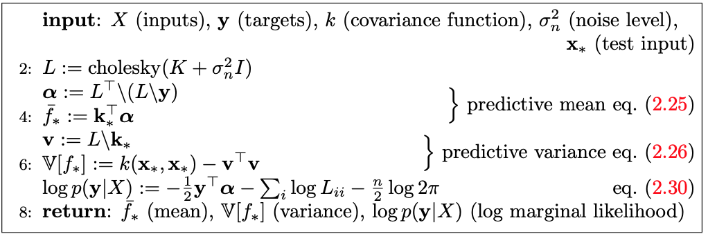
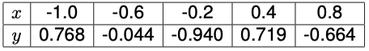
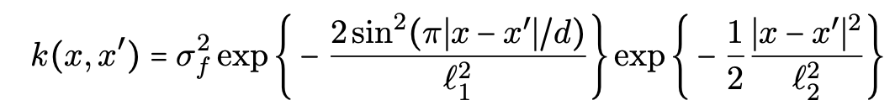

```{r setup, include=FALSE}
knitr::opts_chunk$set(echo = FALSE)
```


```{r functions-used}
# Kernel function
# Input:
#   X: Observations
#   XStar: Observations
#   sigmaF: Standard deviation of f
#   l: Smoothness factor

KerlenSquaredExp <- function(X, XStar, sigmaF, l) {
  X.len <- length(X)
  XStar.len <- length(XStar)
  kValues <- matrix(NA, X.len, XStar.len)
  
  for (i in 1:XStar.len) {
    kValues[, i] <- sigmaF ^ 2 * exp(-0.5 * ((X - XStar[i]) / l) ^ 2)
  }
  return(kValues)
}

# Function posteriorGP

## Inputs
### X: Vector of training inputs.
### y: Vector of training targets/outputs.
### XStar: Vector of inputs where the posterior distribution is evaluated, i.e. X_*.
### sigmaNoise: Noise standard deviation sigma_n.
### k: Covariance function or kernel.

posteriorGP <- function(X, y, XStar, sigmaNoise, k, ...) {
  kValues <- KerlenSquaredExp(X, X, ...)
  kStarValues <- KerlenSquaredExp(X, XStar, ...)
  I <- diag(length(diag(kStarValues)))
  L <- t(chol(kValues + (sigmaNoise ^ 2 * I)))
  alpha <- solve(a = t(L), b = solve(a = L, b = y))
  fStar <- t(kStarValues) %*% alpha
  v <- solve(a = L, b = kStarValues)
  vfStart <-
    diag(KerlenSquaredExp(XStar, XStar, ...) - (t(v) %*% v))
  logMarginalLikelihood <-
    (-1 / 2) * t(y) %*% alpha - sum(log(L)) - (length(X) / 2) * log(2 * pi)
  
  return(
    list(
      mean = fStar,
      variance = vfStart,
      logMarginalLikelihood = logMarginalLikelihood
    )
  )
}

```

# Part 1

**Implementing GP Regression.** This first exercise will have you writing your own code for the Gaussian process regression model:

$y = f(x) + \epsilon$ with $\epsilon \sim N(0,\sigma_{n}^{2})$ and $f \sim GP(0,k(x,x^{\prime}))$.

## Task 1.1

Implement the algorithm provided by Rasmussen and Willams.
```{r, fig.show='hold', fig.align='center', out.width="49%"}

```

Below is the implementation of the algorithm provided by Rasmussen and Willams.

```{r eval=FALSE, echo=TRUE}
# Function posteriorGP

## Inputs
### X: Vector of training inputs.
### y: Vector of training targets/outputs.
### XStar: Vector of inputs where the posterior distribution is evaluated, i.e. X_*.
### sigmaNoise: Noise standard deviation sigma_n.
### k: Covariance function or kernel.

posteriorGP <- function(X, y, XStar, sigmaNoise, k, ...) {
  kValues <- KerlenSquaredExp(X, X, ...)
  kStarValues <- KerlenSquaredExp(X, XStar, ...)
  I <- diag(length(diag(kStarValues)))
  L <- t(chol(kValues + (sigmaNoise ^ 2 * I)))
  alpha <- solve(a = t(L), b = solve(a = L, b = y))
  fStar <- t(kStarValues) %*% alpha
  v <- solve(a = L, b = kStarValues)
  vfStart <-
    diag(KerlenSquaredExp(XStar, XStar, ...) - (t(v) %*% v))
  logMarginalLikelihood <-
    (-1 / 2) * t(y) %*% alpha - sum(log(L)) - (length(X) / 2) * log(2 * pi)
  
  return(
    list(
      mean = fStar,
      variance = vfStart,
      logMarginalLikelihood = logMarginalLikelihood
    )
  )
}
```


## Task 1.2

Now, let the prior hyperparameters be $\sigma_{f} = 1$ and $l=0.3$. Update the prior with the single observation $(x,y) = (0.4,0.719)$. Assume $\sigma_{n} = 0.1$. Plot the posterior mean of $f$ over the interval $x \in [-1,1]$. Also plot the 95% probability bands of $f$.

```{r 212_1}
# task 2.1.2

sigmaF <- 1
l = 0.3
sigmaNoise <- 0.1

xGrid <- seq(-1, 1, length.out = 200)

Obs <- data.frame(x = c(0.4), y = c(0.719))

fPosterior <-
  posteriorGP(
    X = Obs$x ,
    y = Obs$y ,
    XStar = xGrid,
    sigmaNoise = sigmaNoise,
    sigmaF = sigmaF,
    l = l
  )

CI <-
  data.frame(
    upper = fPosterior$mean + 1.96 * sqrt(fPosterior$variance),
    lower = fPosterior$mean - 1.96 * sqrt(fPosterior$variance)
  )

plot(
  x = xGrid,
  y = fPosterior$mean,
  type = 'l',
  col = 'red',
  ylab = 'Posterior mean',
  xlab = 'xGrid',
  ylim = c(min(CI$lower), max(CI$upper)),
  main = paste("sigmaF =", sigmaF, "| l =", l)
)


lines(xGrid, CI$upper , col = "blue")
lines(xGrid, CI$lower , col = "blue")
points(Obs, col = "green", pch = 16)

legend(
  'topleft',
  legend = c('Mean of f', 'CI' , 'Observation'),
  col = c('red', 'blue', 'green'),
  lty = c(1, 1, NA),
  pch = c(NA, NA, 16)
)


```

## Task 1.3

Update your posterior from (2) with another observation: $(x,y) = (-0.6,-0.044)$. Plot the mean of $f$ over the same interval as in (2) and add the 95 % probability bands for $f$.

```{r 213_1}
# task 2.1.3

sigmaF <- 1
l = 0.3
sigmaNoise <- 0.1

xGrid <- seq(-1, 1, length.out = 200)

Obs <- data.frame(x = c(0.4,-0.6), y = c(0.719,-0.044))

fPosterior <-
  posteriorGP(
    X = Obs$x ,
    y = Obs$y ,
    XStar = xGrid,
    sigmaNoise = sigmaNoise,
    sigmaF = sigmaF,
    l = l
  )

CI <-
  data.frame(
    upper = fPosterior$mean + 1.96 * sqrt(fPosterior$variance),
    lower = fPosterior$mean - 1.96 * sqrt(fPosterior$variance)
  )

plot(
  x = xGrid,
  y = fPosterior$mean,
  type = 'l',
  col = 'red',
  ylab = 'Posterior mean',
  xlab = 'xGrid',
  ylim = c(min(CI$lower), max(CI$upper)),
  main = paste("sigmaF =", sigmaF, "| l =", l)
)


lines(xGrid, CI$upper , col = "blue")
lines(xGrid, CI$lower , col = "blue")
points(Obs, col = "green", pch = 16)

legend(
  'topleft',
  legend = c('Mean of f', 'CI' , 'Observation'),
  col = c('red', 'blue', 'green'),
  lty = c(1, 1, NA),
  pch = c(NA, NA, 16)
)
```

## Task 1.4

Compute the posterior distribution of $f$ using all the five data points in the table below:

```{r, fig.show='hold', fig.align='center', out.width="49%"}

```


```{r 214_1}
# task 2.1.4

sigmaF <- 1
l = 0.3
sigmaNoise <- 0.1

xGrid <- seq(-1, 1, length.out = 50)

Obs <- data.frame(
  x = c(-1.0, -0.6, -0.2, 0.4, 0.8),
  y = c(0.768, -0.044, 0.940, 0.719, -0.664)
)

fPosterior <-
  posteriorGP(
    X = Obs$x ,
    y = Obs$y ,
    XStar = xGrid,
    sigmaNoise = sigmaNoise,
    sigmaF = sigmaF,
    l = l
  )

CI <-
  data.frame(
    upper = fPosterior$mean + 1.96 * sqrt(fPosterior$variance),
    lower = fPosterior$mean - 1.96 * sqrt(fPosterior$variance)
  )

plot(
  x = xGrid,
  y = fPosterior$mean,
  type = 'l',
  col = 'red',
  ylab = 'Posterior mean',
  xlab = 'xGrid',
  ylim = c(min(CI$lower) - 0.2, max(CI$upper) + 0.2),
  main = paste("sigmaF =", sigmaF, "| l =", l)
)


lines(xGrid, CI$upper , col = "blue")
lines(xGrid, CI$lower , col = "blue")
points(Obs, col = "green", pch = 16)

legend(
  'topleft',
  legend = c('Mean of f', 'CI' , 'Observation'),
  col = c('red', 'blue', 'green'),
  lty = c(1, 1, NA),
  pch = c(NA, NA, 16)
)
```

## Task 1.5

Repeat (4), this time with hyperparameters $\sigma_{f}=1$ and $l = 1$. Compare the results.

```{r 215_1}
# task 2.1.5


sigmaF <- 1
l = 1
sigmaNoise <- 0.1

xGrid <- seq(-1, 1, length.out = 50)

Obs <- data.frame(
  x = c(-1.0, -0.6, -0.2, 0.4, 0.8),
  y = c(0.768, -0.044, 0.940, 0.719, -0.664)
)

fPosterior <-
  posteriorGP(
    X = Obs$x ,
    y = Obs$y ,
    XStar = xGrid,
    sigmaNoise = sigmaNoise,
    sigmaF = sigmaF,
    l = l
  )

CI <-
  data.frame(
    upper = fPosterior$mean + 1.96 * sqrt(fPosterior$variance),
    lower = fPosterior$mean - 1.96 * sqrt(fPosterior$variance)
  )

plot(
  x = xGrid,
  y = fPosterior$mean,
  type = 'l',
  col = 'red',
  ylab = 'Posterior mean',
  xlab = 'xGrid',
  ylim = c(min(CI$lower) - 0.2, max(CI$upper) + 0.2),
  main = paste("sigmaF =", sigmaF, "| l =", l)
)


lines(xGrid, CI$upper , col = "blue")
lines(xGrid, CI$lower , col = "blue")
points(Obs, col = "green", pch = 16)

legend(
  'bottomleft',
  legend = c('Mean of f', 'CI' , 'Observation'),
  col = c('red', 'blue', 'green'),
  lty = c(1, 1, NA),
  pch = c(NA, NA, 16)
)

```

**Comparision**
Increasing $l$ results in a smoother function. However in this case the function seems to be so smooth that the prior data points are not fully taken into account.

# Part 2

In this exercise, you will work with the daily mean temperature in Stockholm (Tullinge) during the period January 1, 2010 - December 31, 2015. The leap year day February 29, 2012 is removed to make things simpler. 

```{r setup_2.2}
# Part 2.2
library(kernlab)

preset_KerlenSquaredExp <- function(sigmaF, l) {
  KerlenSquaredExp <- function(X, XStar = NULL) {
    X.len <- length(X)
    XStar.len <- length(XStar)
    kValues <- matrix(NA, X.len, XStar.len)
    
    for (i in 1:XStar.len) {
      kValues[, i] <- sigmaF ^ 2 * exp(-0.5 * ((X - XStar[i]) / l) ^ 2)
    }
    return(kValues)
  }
  
  class(KerlenSquaredExp) <- 'kernel'
  return(KerlenSquaredExp)
}

## getting data and doing setup
data <-
  read.csv(
    "https://github.com/STIMALiU/AdvMLCourse/raw/master/GaussianProcess/Code/TempTullinge.csv",
    header = TRUE,
    sep = ";"
  )
time <- seq(1, nrow(data), 1)
day <-
  c(seq(1, 365),
    seq(1, 365),
    seq(1, 365),
    seq(1, 365),
    seq(1, 365),
    seq(1, 365))
data$time <- time
data$day <- day

sampleIndexes <- seq(1, nrow(data), 5)

dataSample <- data[sampleIndexes,]

```

## Task 2.1

Define your own square exponential kernel function (with parameters l (ell) and $\sigma_f$ (sigmaf)).

```{r definition_own_kernel, eval=FALSE, echo=TRUE}
preset_KerlenSquaredExp <- function(sigmaF, l) {
  KerlenSquaredExp <- function(X, XStar = NULL) {
    X.len <- length(X)
    XStar.len <- length(XStar)
    kValues <- matrix(NA, X.len, XStar.len)
    
    for (i in 1:XStar.len) {
      kValues[, i] <- sigmaF ^ 2 * exp(-0.5 * ((X - XStar[i]) / l) ^ 2)
    }
    return(kValues)
  }
  
  class(KerlenSquaredExp) <- 'kernel'
  return(KerlenSquaredExp)
}
```

Use your function to evaluate the point $x=1, x^{\prime}=2$. Use the `kernelMatrix` function
to compute the covariance matrix $K(X,X_*)$ for the vectors $X = (1, 3, 4)^T$ and $X_* = (2, 3, 4)^T$.

```{r 221_1}
# 2.2.1

ownKernel <- preset_KerlenSquaredExp(sigmaF = 1, l = 0.3)

X <- c(1, 3, 4)
xStar <- c(2, 3, 4)

covMatrix <- kernelMatrix(x = X,
                          y = xStar,
                          kernel = ownKernel)
print("Eval for x = 1, xStar = 2")
print(ownKernel(1,2))
cat("\n\n")
print("Covariance matrix for vectors X and xStart")
print(covMatrix)
```

## Task 2.2

Consider first the following model:
$temp = f(time) + \epsilon$ with $\epsilon \sim N(0,\sigma_{n}^{2})$ and $f \sim GP(0,k(time,time^\prime))$.

Let $\sigma_n^2$ be the residual variance from a simple quadratic regression fit. Estimate the above Gaussian process regression model using the squared exponential function from (1) with $\sigma_f = 20$ and $l = 0.2$. Make a scatterplot of the data and superimpose the posterior mean of f as a curve.

```{r 222_1}
# 2.2.2

simpleModel <- lm(dataSample$temp ~ poly(dataSample$time, 2))
sigmaNoise <- sd(simpleModel$residuals)

sigmaF <- 20
l <- 0.2

ownKernel <- preset_KerlenSquaredExp(sigmaF = sigmaF, l = l)

# Fit GP to observed data
GP.fit <- gausspr(
  x = dataSample$time,
  y = dataSample$temp,
  kernel = preset_KerlenSquaredExp,
  kpar = list(sigmaF = sigmaF, l = l),
  var = sigmaNoise ^ 2
)

# Predict using fitted GP
posteriorMean <- predict(GP.fit, dataSample$time)

plot(
  dataSample$time,
  dataSample$temp,
  main = paste("sigmaF =", sigmaF, "| l =", l) ,
  ylab = "Mean of f",
  lwd = 0.5
)
lines(dataSample$time, posteriorMean, col = "red")

```

## Task 2.3

Do your own computations for the posterior variance of f and plot the 95 % probability bands for $f$.

Calculations

```{r eval=FALSE, echo = TRUE}
x <- dataSample$time
xs <- dataSample$time # XStar.
n <- length(x)
Kss <- kernelMatrix(kernel = ownKernel, x = xs, y = xs)
Kxx <- kernelMatrix(kernel = ownKernel, x = x, y = x)
Kxs <- kernelMatrix(kernel = ownKernel, x = x, y = xs)
Covf = Kss - t(Kxs) %*% solve(Kxx + sigmaNoise ^ 2 * diag(n), Kxs) # Covariance matrix of fStar.

CI <- data.frame(upper = posteriorMean + 1.96 * sqrt(diag(Covf)),
                 lower = posteriorMean - 1.96 * sqrt(diag(Covf)))
```


```{r 223_1}
# 2.2.3

x <- dataSample$time
xs <- dataSample$time # XStar.
n <- length(x)
Kss <- kernelMatrix(kernel = ownKernel, x = xs, y = xs)
Kxx <- kernelMatrix(kernel = ownKernel, x = x, y = x)
Kxs <- kernelMatrix(kernel = ownKernel, x = x, y = xs)
Covf = Kss - t(Kxs) %*% solve(Kxx + sigmaNoise ^ 2 * diag(n), Kxs) # Covariance matrix of fStar.

CI <- data.frame(upper = posteriorMean + 1.96 * sqrt(diag(Covf)),
                 lower = posteriorMean - 1.96 * sqrt(diag(Covf)))

plot(
  dataSample$time,
  dataSample$temp,
  main = paste("sigmaF =", sigmaF, "| l =", l),
  ylim = c(min(CI$lower), max(CI$upper)),
  ylab = "Mean of f"
)
lines(dataSample$time,
      posteriorMean,
      col = "red",
      lwd = 2)

# Probability intervals for fStar.
lines(xs, CI$lower, col = "blue")
lines(xs, CI$upper, col = "blue")

```

## Task 2.4

Consider first the following model:
$temp = f(day) + \epsilon$ with $\epsilon \sim N(0,\sigma_{n}^{2})$ and $f \sim GP(0,k(day,day^\prime))$. Estimate the model using the squared exponential function with $\sigma_f = 20$ and $l = 0.2$. Superimpose the posterior mean from this model on the posterior mean from the model in (2).

```{r 224}
# 2.2.4

simpleModel <- lm(dataSample$temp ~ poly(dataSample$day, 2))
sigmaNoise <- sd(simpleModel$residuals)

sigmaF <- 20
l <- 0.2

ownKernel <- preset_KerlenSquaredExp(sigmaF = sigmaF, l = l)

# Fit GP to observed data
GP.fit <- gausspr(
  x = dataSample$day,
  y = dataSample$temp,
  kernel = preset_KerlenSquaredExp,
  kpar = list(sigmaF = sigmaF, l = l),
  var = sigmaNoise ^ 2
)

# Predict using fitted GP
posteriorMean.day <- predict(GP.fit, dataSample$day)

plot(
  dataSample$time,
  dataSample$temp,
  main = "Comparison between time and day as x variable",
  lwd = 0.2,
  ylab = "Mean of f"
)
lines(dataSample$time, posteriorMean, col = "red")
lines(dataSample$time, posteriorMean.day, col = "blue")
legend(
  'bottomright',
  legend = c('Mean of f(time)', 'Mean of f(day)'),
  col = c('red', 'blue'),
  lty = c(1, 1),
  pch = c(NA, NA)
)

```

**Pros and cons**

The model that uses $time$ better models the data in each period. However it often misses peaks or areas of higher density in the underlaying data. The model taht uses $day$ is better at representing areas with high density over time. However this model has "problems" in regards to "discouting" data further in the future. Which can be seen as the blue line near the begining (time = 0) has a higher min value than the read graph. This is due to the trend of rising temperature. Which affects the $day$-model. It has no way of taking in to account if a specific datapoint is from one year into the future or if it is five years. 


## Task 2.5

In this task you will implement a generalization of the periodic kernel given in the lectures:

```{r, fig.show='hold', fig.align='center', out.width="49%"}

```

Note that we have two different length scales here, and $l_2$ controls the correlation between the same day in different years. Estimate the GP model using the time variable with this kernel and hyperparameters $\sigma_f=20,l_1=1,l_2=10$ and $d=365/sd(time)$. Compare the fit to the previous two models (with $\sigma_f=20$ and $l = 0.2$).

```{r 225}
# 2.2.5

generalizationPeriodicKernel <- function(sigmaF, l_1, l_2, d) {
  kernelFunc <- function (X, XStar = NULL) {
    absDist <- abs(X - XStar)
    return ((sigmaF ^ 2) * exp(-2 * (sin(pi * absDist / d) ^ 2) / (l_1 ^
                                                                     2)) * exp(-(1 / 2) * (absDist / l_2) ^ 2))
  }
  
  class(kernelFunc) <- 'kernel'
  return (kernelFunc)
}

simpleModel <- lm(dataSample$temp ~ poly(dataSample$time, 2))
sigmaNoise <- sd(simpleModel$residuals)

sigmaF <- 20
l_1 <- 1
l_2 <- 10
d <- 365 / sd(dataSample$time)

GP.fit <- gausspr(
  x = dataSample$time,
  y = dataSample$temp,
  kernel = generalizationPeriodicKernel,
  kpar = list(
    sigmaF = sigmaF,
    l_1 = l_1,
    l_2 = l_2,
    d = d
  ),
  var = sigmaNoise ^ 2
)

posteriorMean.general <- predict(GP.fit, dataSample$time)

plot(
  dataSample$time,
  dataSample$temp,
  main = "Comparison between GP model predictions",
  lwd = 0.2,
  ylab = "Mean of f"
)
lines(dataSample$time, posteriorMean, col = "red")
lines(dataSample$time, posteriorMean.day, col = "blue")
lines(dataSample$time, posteriorMean.general, col = "green")
legend(
  'bottomright',
  legend = c(
    'Mean of f(time)',
    'Mean of f(day)',
    'Mean of f(time) generalizationPeriodicKernel'
  ),
  col = c('red', 'blue', 'green'),
  lty = c(1, 1, 1),
  pch = c(NA, NA, NA)
)

```

**Comparision**

As can be expected the *periodic generalization kernel* does a better job att both identifying areas of higher density as well as the over all trend. The problem that the $day$-model had with being affected of future data without a "discount factor" is handled by the new $time$-model. 

# Part 3

In this part we work with a dataset of banknote fraud data. 1000 observations are choosen for training and the rest becomes testing data

```{r setup_2.3}
# Part 2.3

## Downloading data and setup
library(kernlab)
library(AtmRay)
data <-
  read.csv(
    "https://github.com/STIMALiU/AdvMLCourse/raw/master/GaussianProcess/Code/banknoteFraud.csv",
    header = FALSE,
    sep = ","
  )
names(data) <-
  c("varWave", "skewWave", "kurtWave", "entropyWave", "fraud")
data[, 5] <- as.factor(data[, 5])

```

```{r, echo=TRUE}
## Traing and test data
set.seed(111)
SelectTraining <-
  sample(1:dim(data)[1], size = 1000, replace = FALSE)
train <- data[SelectTraining, ]
test <- data[-SelectTraining, ]
```


## Task 3.1

Use the R package kernlab to fit a Gaussian process classification model for fraud on the training data. Use the default kernel and hyperparameters. Start using only the covariates *varWave* and *skewWave* in the model. Plot contours of the prediction probabilities over a suitable grid of values for *varWave* and *skewWave.* Overlay the training data for fraud = 1 (as blue points) and fraud = 0 (as red points). Compute the confusion matrix for the classifier and its accuracy.

```{r 231}
# 2.3.1

GP.fit <- gausspr(fraud ~ varWave + skewWave, data = train)

xGrid1 <- seq(
  from = min(train$varWave),
  to = max(train$varWave),
  length = 100
)
xGrid2 <- seq(
  from = min(train$skewWave),
  to = max(train$skewWave),
  length = 100
)

gridPoints <- meshgrid(xGrid1, xGrid2)
gridPoints <- cbind(c(gridPoints$x), c(gridPoints$y))

gridPoints <- data.frame(gridPoints)
names(gridPoints) <- c("varWave", "skewWave")
probPreds <- predict(GP.fit, gridPoints, type = "probabilities")


contour(
  x = xGrid1,
  y = xGrid2,
  z = matrix(probPreds[, 2], 100, byrow = TRUE),
  20,
  xlab = "varWave",
  ylab = "skewWave",
  main = 'Probability of fraud'
)

casesOfFraud <- which(train$fraud==1)

points(x = train$varWave[casesOfFraud], y = train$skewWave[casesOfFraud], col = 'blue')
points(x = train$varWave[-casesOfFraud], y = train$skewWave[-casesOfFraud], col = 'red')

train.pred <- predict(GP.fit, train, type = "probabilities")
classifiedFraud <- ifelse(train.pred[,2]>0.5,1,0)

confmtx <- table(predictions=classifiedFraud,true=train$fraud)
acc <- sum(diag(confmtx))/sum(confmtx)

print("Confusion matrix")
print(confmtx)
cat("\n\n")
print("Accuracy")
print(acc)

```

## Task 3.2

Using the estimated model from (1), make predictions for the test set. Compute the accuracy.

```{r 232}
# 2.3.2

test.pred <- predict(GP.fit, test, type = "probabilities")
classifiedFraud <- ifelse(test.pred[,2]>0.5,1,0)

confmtx <- table(predictions=classifiedFraud,true=test$fraud)
acc <- sum(diag(confmtx))/sum(confmtx)
print("Confusion matrix")
print(confmtx)
cat("\n\n")
print("Accuracy")
print(acc)

```

## Task 3.3

Train a model using all four covariates. Make predictions on the test set and compare the accuracy to the model with only two covariates.

```{r 233}
# 2.3.3

GP.fit.all <- gausspr(fraud ~ ., data = train)

test.pred <- predict(GP.fit.all, test, type = "probabilities")
classifiedFraud <- ifelse(test.pred[,2]>0.5,1,0)

confmtx2 <- table(predictions=classifiedFraud,true=test$fraud)
acc2 <- sum(diag(confmtx2))/sum(confmtx2)

print("Confusion matrix")
print(confmtx2)
cat("\n\n")
print("Accuracy")
print(acc2)

```

**Comparision**

As one can see the accuracy increases when all four covariates are used. However the accuracy when only using covariates for *varWave* and *skewWave* is already high. Here one could consider the balance between speed of processing and accuracy.

\newpage

## Appendix for code

```{r, code=readLines("lab4.R"), echo=TRUE, eval=FALSE}
```
